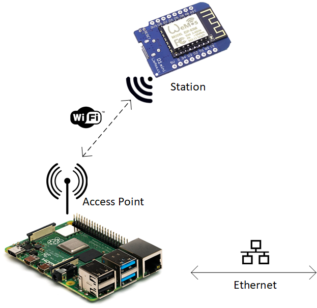

# Lab Exercise - ESP8266 and connecting to WiFi

This lab will introduce students to connecting the ESP8266 to WiFi.

The ESP8266 has 3 WiFi modes:

* Access Point (AP)
* Station (STA)
* Access Point + Station

### Soft Access Point (AP)

In Access Point (AP) mode, the ESP8266 module acts as an access point. It provides a WiFi network that other network devices can connect to (like a mobile or laptop.)

Usually, an access point can provide internet through a wired network to the connected devices but as there is no wired interface, this Access Point mode is called Soft Access Point.

### Station Mode (STA)

In Station Mode (STA), the ESP8266 WiFi Module will be connected to a WiFi Network that is already setup by an Access Point, like a WiFi Router.

This is the mode that we will be using. Eventually we want to be able to send sensor data read by the ESP8266 to cloud services. This will require being able to connect the ESP8266 to a network that has access to the internet.

### Soft AP + Station

In the third mode, the ESP8266 WiFi Module is configured to act in both Station Mode and Soft AP Mode.

 

## Exercise 1

In this exercise, we will connect the ESP8266 to a Raspberry Pi that has been configured to act as a WiFi access point.

Q1. What makes the Raspberry Pi suitable to act as an Access Point?

### Instructions

1. Open the [wifi-exercise-1](arduino/wifi-exercise-1/wifi-exercise-1.ino) sketch.

1. In the appropriate point in the code, enter the SSID and passphrase for the WiFi access point. These need to be entered as strings.

    * SSID = PiDev-WiFi
    * Passphrase = AardvarkBadger

1. Upload the sketch to the device

1. Open the serial monitor and check the device is connecting to the WiFi access point.

    

Q2. What is the IP address reported of your ESP8266?

## Exercise 2

Sometimes it is beneficial to put configuration settings into a seperate configuration file. This is useful when:

* our project grows in complexity. Keeping settings in one place makes it easier to update them,
* Or, we want to be able to easily copy settings between similar projects.

In this exercise, we are going to move the WiFi access point settings to a seperate `config.h` file.

### Instructions

1. Open the 2nd '[wifi-exercise-2](arduino/wifi-exercise-2/wifi-exercise-2.ino)' sketch.

1. In the appropriate point in the code, enter the SSID and passphrase for the WiFi access point. These need to be entered as strings.

    * SSID = PiDev-WiFi
    * Passphrase = AardvarkBadger

1. Upload the sketch to the device

1. Open the serial monitor and check the device is connecting to the WiFi access point.

    

Q3. How are the configuration settings loaded into our sketch?
Q4. How is it different from how the WiFi libary is imported?

## Exercise 3

The second sketch also has a line of code that generates a hostname for the device. A hostname makes it easier to find and identify a device on a network (rather than trying to use it's IP address.)

### Instructions

1. Move this variable to the `config.h` file.

1. Give your device it's own hostname.

1. Test that your code works.

 

## Advanced Exercise 1

Q5. Why might we not want every device in a network to have the same hostname?

Q6. Many IoT systems use thousands (or hundreds of thousands) of devices. For example, smart meters. Would you want to manually create a unique hostname for each device?

### Instructions

1. Research a method to generate a unique host name for your device.

1. Impliment the code for your method in the 2nd sketch.
